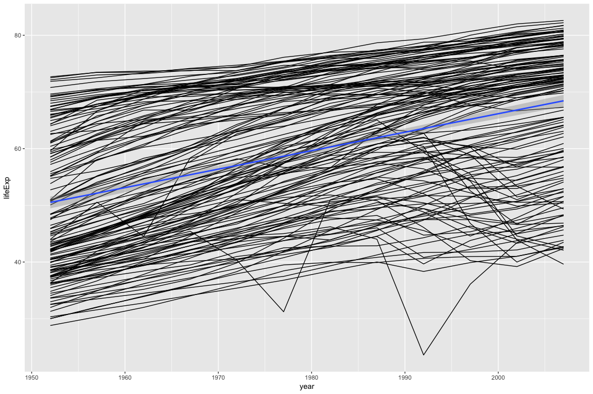

<!-- rmarkdown::render("README.Rmd") -->
<!-- README.md is generated from README.Rmd. Please edit that file -->
auto\_cogs
==========

[](https://travis-ci.org/schloerke/autocogs) [](https://codecov.io/github/schloerke/autocogs?branch=master) [](https://cran.r-project.org/package=autocogs)

Cognostics are univariate statistics (or metrics) for a subset of data. When paired with the underlying data of visualizations, cognostics are a powerful tool for ordering and filtering the visualizations. `add_panel_cogs()` will automatically append cognostics for each plot player in a given panel column. The newly appended data can be fed into a [trelliscopejs](github.com/hafen/trelliscopejs) widget for easy viewing.

Installation
------------

You can install autocogs from github with:

``` r
# install.packages("devtools")
devtools::install_github("schloerke/autocogs")
```

Examples
--------

### Gapminder

``` r
library(tidyverse)
#> [1] TRUE
library(gapminder)
#> [1] TRUE
library(gapminder)
#> [1] TRUE
library(autocogs)
#> [1] TRUE
# devtools::install_github("hafen/trelliscopejs")
library(trelliscopejs)
#> [1] TRUE

# Explore
p <-
  ggplot(gapminder, aes(year, lifeExp)) +
  geom_line(aes(group = country)) +
  geom_smooth(method = "lm")
p
```



Looking at the plot above, most countries follow a linear trend: As the year increases, life expectancy goes up. A few countries do not follow a linear trend.

In the examples below, we will extract cognostics to aid in exploring the countries whose life expectancy is not linear.

#### `trelliscopejs::facet_trelliscope()`

``` r
ggplot(gapminder, aes(year, lifeExp)) +
  geom_line() +
  geom_smooth(method = "lm") +
  trelliscopejs::facet_trelliscope(
    # facet by 'country' and 'continent'
    ~ country + continent,
    # calculate the automatic cognostics for each plot layer using `autocogs` package
    auto_cog = TRUE,
    nrow = 4, ncol = 8,
    self_contained = TRUE,
    # set the state to display the country, continent, and R^2 value
    #   sorted by ascending R^2 value
    state = list(
      sort = list(list(name = "r2", dir = "asc")),
      labels = c("country", "continent", "r2")
    )
  ) %>%
  print()
```

#### Full Example

This is a full, start to finish example how automatic cognostics could be inserted into a data exploration workflow.

``` r
## # Set up data and panel column
gapminder %>%
  group_by(country, continent) %>%
  # nest the data according to the country and continent
  nest() %>%
  mutate(
    # create a column of plots with a
    # * line
    # * points
    # * and a linear model
    panel = lapply(data, function(dt) {
      ggplot(dt, aes(year, lifeExp)) +
        geom_line() +
        geom_point() +
        geom_smooth(method = "lm")
    })
  ) %>%
  print() ->
gap_data

# Double check the plot worked...
# Look at the first panel (ggplot2 plot) of Afghanistan
gap_data$panel[[1]]

#####
# Add cognostic information given the panel column plots
#####
gap_data %>%
  autocogs::add_panel_cogs() %>%
  # double check it was added
  print() ->
full_gap_data

tibble::glimpse(full_gap_data)

# Display the panel and cognostics in a trelliscopejs widget
trelliscopejs::trelliscope(
  full_gap_data, "gapminder life expectancy",
  panel_col = "panel",
  ncol = 8, nrow = 4,
  auto_cog = FALSE,
  self_contained = TRUE,
  state = list(
    # sort by ascending R^2 value (percent explained by linear model)
    sort = list(list(name = "r2", dir = "asc")),
    # display the country, continent, and R^2 value
    labels = c("country", "continent", "r2")
  )
)
# (screen shot of trelliscopejs widget)
```
